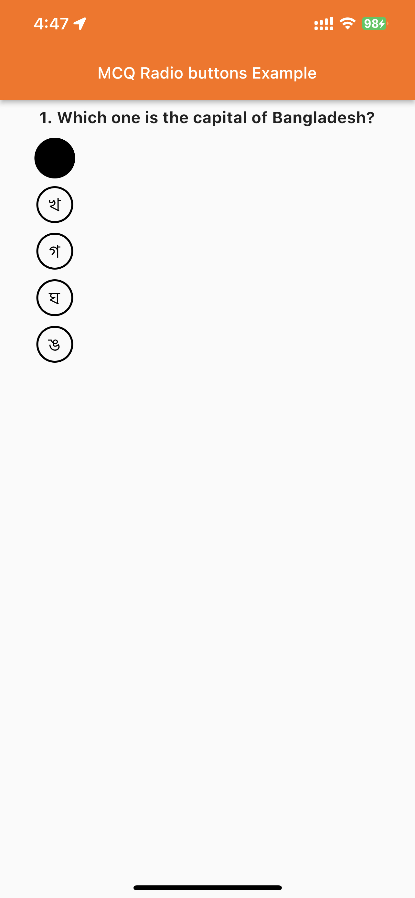

# MCQRadio

MCQRadio is a Flutter package that provides a customizable Radio widget for multiple-choice questions (MCQs) based on the Flutter Radio widget. It enables developers to create a Radio button with an alphabet in the center, as well as to customize the color, size, and style of the button and its text.

## Features

* Create a Radio button with an alphabet in the center
* Customize the color, size, and style of the button and its text
* Support for both dark and light themes
* Works seamlessly with Flutter's Material Design

## Getting started

To use MCQRadio, add the package to your dependencies in the `pubspec.yaml` file:

```dart
dependencies:
  mcq_radio: ^1.0.0
```

Then run flutter pub get in the terminal to download and install the package.

In your Dart code, import the package:

```dart
import 'package:mcq_radio/mcq_radio.dart';
```

## Usage

Use the MCQRadio widget to create a Radio button for MCQs. Here is an example of how to use it:

```dart
const one = "ক";
const two = "খ";
const three = "গ";
const four = "ঘ";
const five = "ঙ";
const unanswered = "";

enum OptionTitles { one, two, three, four, five, unanswered }

OptionTitles _optionTitle = OptionTitles.unanswered;

MCQRadio<OptionTitles>(
    fillColor: MaterialStateColor.resolveWith(
        (states) => Colors.black), // color of the radio button
    value: OptionTitles
        .one, // value of the radio button (enum) ক, খ, গ, ঘ, ঙ etc
    groupValue: _optionTitle, // value of the selected radio button
    mcqOptionAlphabetStyle: const TextStyle(
        fontSize: 20,
        fontFamily: "SolaimanLipi",
        color: Colors.black, // color of the radio button Alphabet
    ), // style of the radio button text
    circleRadius: 20, // radius of the radio button
    mcqOptionAlphabet: one,
    onChanged: (OptionTitles? value) {
        setState(() {
        _optionTitle = value!;
        });
    },
    );
```

## Screenshots



## Additional information

* The `fillColor` parameter is used to set the color of the Radio button when it is selected. It uses a `MaterialStateColor` object to change the color based on the state of the button.
* The `value` parameter is used to set the value of the Radio button. It should be an `enum` value that corresponds to the letter displayed in the button.
* The `groupValue` parameter is used to determine which Radio button in a group is selected. It should be a variable that holds the currently selected `enum` value.
* The `mcqOptionAlphabetStyle` parameter is used to set the style of the letter displayed in the Radio button.
* The `circleRadius` parameter is used to set the size of the Radio button.
* The `mcqOptionAlphabet` parameter is used to set the letter displayed in the Radio button.
* Use the `onChanged` parameter to update the selected `enum` value when the Radio button is selected.

### Author

[Zuhab](https://github.com/zuhabul)

### Publisher

[CrackTech LTD](https://cracktech.org)
